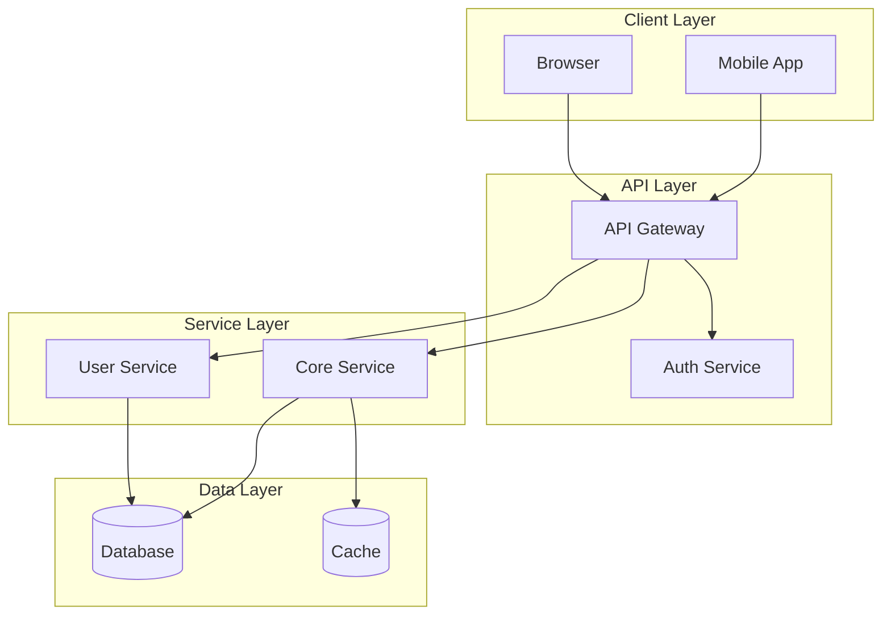
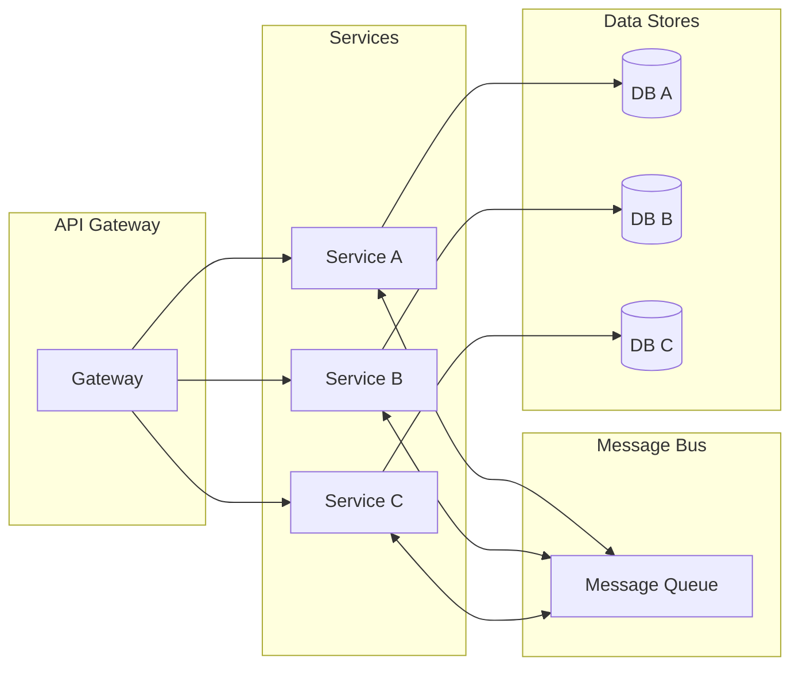
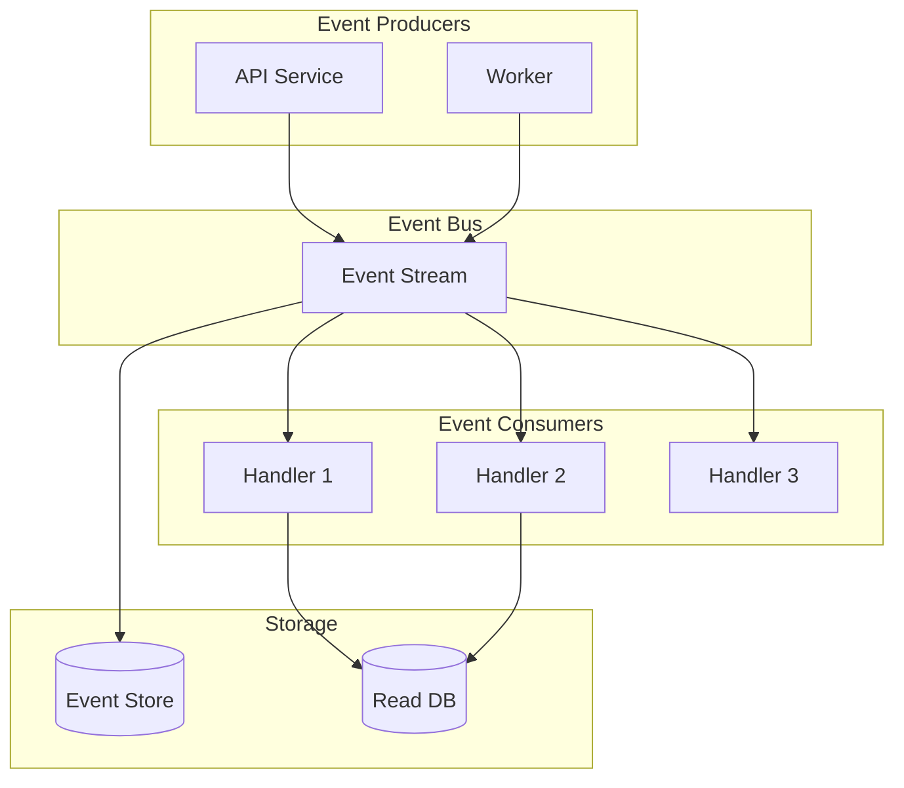
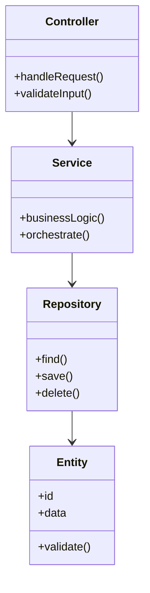
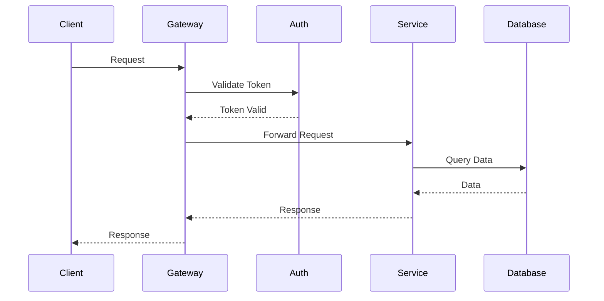
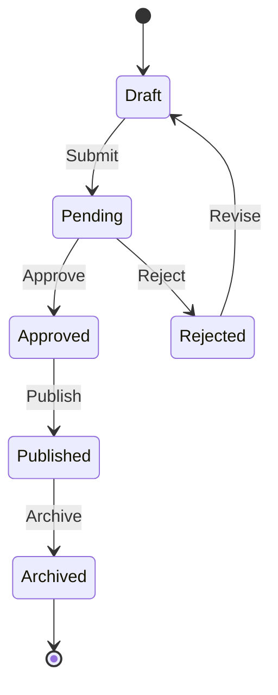
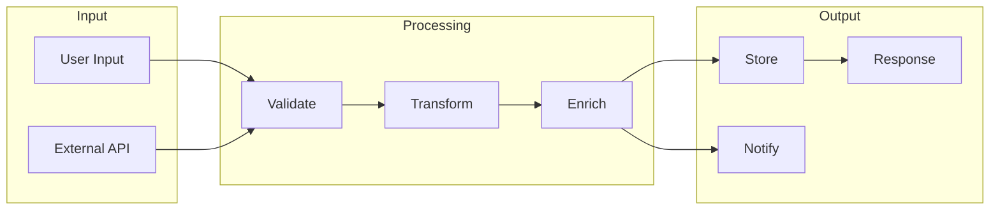
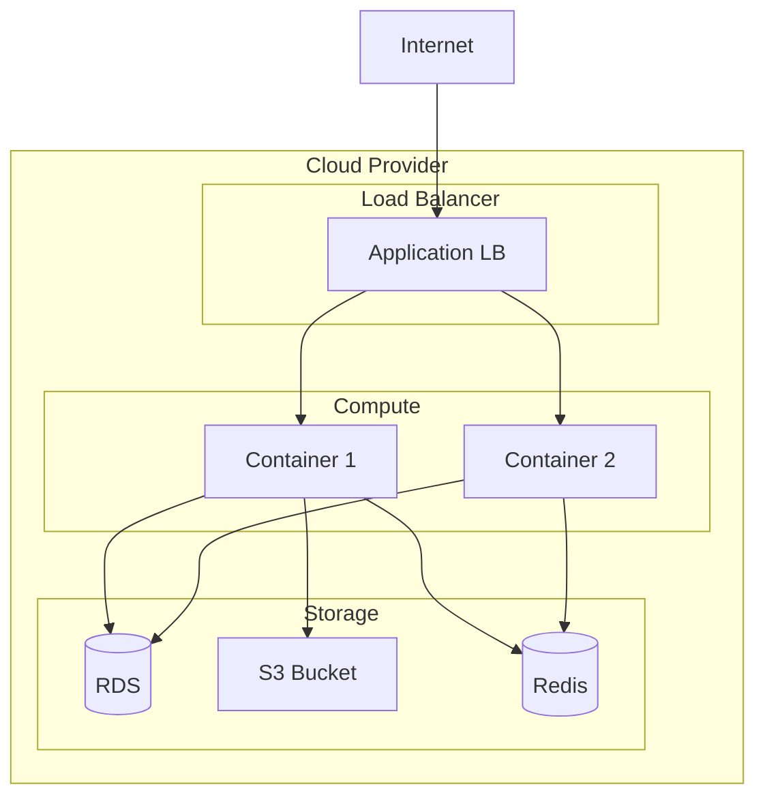

# Architecture Diagram Templates

Mermaid diagram templates for common SDD architectures.

## Basic Web Application

## Microservices Architecture

## Event-Driven Architecture

## Component Diagram

## Sequence Diagram - Request Flow

## State Machine

## Data Flow Diagram

## Deployment Diagram

## Usage Notes

1. Copy the relevant template
2. Replace placeholder names with actual component names
3. Adjust relationships to match your architecture
4. Add or remove components as needed
5. Use consistent naming conventions
