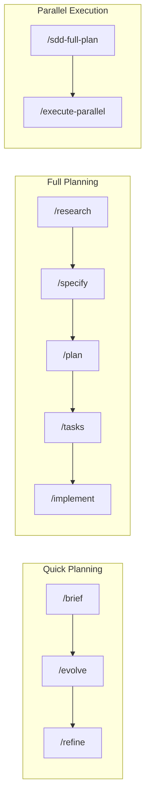

# SDD Cursor Commands v4.1

<div align="center">

[](https://github.com/madebyaris/spec-kit-command-cursor/stargazers)
[](https://opensource.org/licenses/MIT)
[](http://makeapullrequest.com)
[](https://cursor.com)

**Spec-Driven Development for Cursor IDE**

Create specifications before code. Plan-approve-execute for all operations.

[Quick Start](#quick-start) • [Commands](#commands) • [Subagents & Skills](#subagents--skills) • [Contributing](#contributing)

</div>

---

## What's New in v4.1

- **Native Subagents** - 6 specialized agents for parallel execution (no MCP required)
- **Folder-Based Skills** - Progressive loading with references, scripts, and assets
- **Automatic Verification** - `sdd-verifier` runs after every implementation
- **Cursor 2.4+ Optimized** - Full subagent and skill support

---

## Quick Start

```bash
git clone https://github.com/madebyaris/spec-kit-command-cursor.git
cd spec-kit-command-cursor
```

**Most common flow** (copy into Cursor chat):
```
/brief user-auth JWT authentication with login/logout
```

**Full planning:**
```bash
/sdd-full-plan blog-platform Full-featured blog with CMS
/execute-parallel blog-platform
```

---

## Commands

### Planning

| Command | Purpose | Output |
|---------|---------|--------|
| `/brief` | 30-min quick planning | `feature-brief.md` |
| `/research` | Pattern investigation | `research.md` |
| `/specify` | Detailed requirements | `spec.md` |
| `/plan` | Technical architecture | `plan.md` |
| `/tasks` | Task breakdown | `tasks.md` |
| `/generate-prd` | PRD via Socratic questions | `full-prd.md` |
| `/sdd-full-plan` | Complete project roadmap | `roadmap.json` + tasks |

### Execution

| Command | Purpose |
|---------|---------|
| `/implement` | Execute implementation with todo tracking |
| `/execute-task` | Run single task from roadmap |
| `/execute-parallel` | Parallel execution via native subagents |

### Maintenance

| Command | Purpose |
|---------|---------|
| `/evolve` | Update specs with discoveries |
| `/refine` | Iterate on specs through discussion |
| `/upgrade` | Brief → Full SDD planning |
| `/audit` | Compare implementation against specs |
| `/generate-rules` | Auto-generate coding rules |

---

## Subagents & Skills

### Subagents (`.cursor/agents/`)

Specialized agents with isolated context for parallel execution:

| Subagent | Model | Purpose |
|----------|-------|---------|
| `sdd-explorer` | fast | Codebase discovery |
| `sdd-planner` | inherit | Architecture design |
| `sdd-implementer` | inherit | Code generation |
| `sdd-verifier` | fast | Validation after implementation |
| `sdd-reviewer` | fast | Security & performance review |
| `sdd-orchestrator` | inherit | Parallel task coordination |

### Skills (`.cursor/skills/`)

Auto-invoked domain knowledge packages:

| Skill | Auto-Invoke When |
|-------|------------------|
| `sdd-research` | Technical approach unclear |
| `sdd-planning` | Spec exists, need plan |
| `sdd-implementation` | Plan ready for execution |
| `sdd-audit` | Code review requested |
| `sdd-evolve` | Discoveries during development |

Each skill folder contains:
```
sdd-[name]/
├── SKILL.md          # Core instructions
├── references/       # Loaded on demand
├── scripts/          # Executable helpers
└── assets/           # Templates
```

---

## Workflows



| Flow | Commands |
|------|----------|
| **Quick** (80% of features) | `/brief` → `/evolve` → `/refine` |
| **Full** (complex features) | `/research` → `/specify` → `/plan` → `/tasks` → `/implement` |
| **Parallel** (project roadmap) | `/sdd-full-plan` → `/execute-parallel` |

### Automated Execution
```bash
# Execute until complete
/execute-task epic-001 --until-finish

# Create and execute entire project
/sdd-full-plan my-project --until-finish
```

---

## Project Structure

```
.cursor/
├── agents/           # Subagents (6 specialized)
├── skills/           # Skills (5 with progressive loading)
├── commands/         # Slash commands
└── rules/            # Always-applied rules

specs/
├── active/           # Features in development
├── todo-roadmap/     # Project roadmaps with DAG
└── completed/        # Delivered features
```

---

## Contributing

- [Contributing guide](CONTRIBUTING.md) - How to add commands, subagents, and skills
- [Report bugs](https://github.com/madebyaris/spec-kit-command-cursor/issues)
- [Suggest features](https://github.com/madebyaris/spec-kit-command-cursor/discussions)

## Acknowledgments

Thanks to [ClavixDev](https://github.com/ClavixDev) for valuable ideas and suggestions!

## License

MIT License - see [LICENSE](LICENSE)

---

<div align="center">

**Made with ❤️ by [Aris](https://github.com/madebyaris)**

Try it: `/brief hello-world Create a simple hello world feature`

</div>
