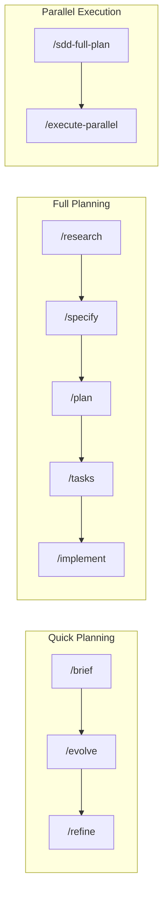
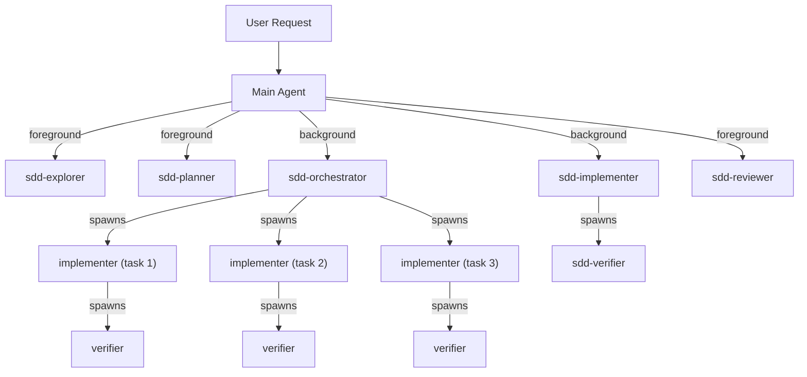

# SDD Cursor Commands v5.0

<div align="center">

[](https://github.com/madebyaris/spec-kit-command-cursor/stargazers)
[](https://opensource.org/licenses/MIT)
[](http://makeapullrequest.com)
[](https://cursor.com)

**Spec-Driven Development for Cursor IDE**

Create specifications before code. Plan-approve-execute for all operations.

[Quick Start](#quick-start) • [Commands](#commands) • [Subagents & Skills](#subagents--skills) • [What's New](#whats-new-in-v50) • [Contributing](#contributing)

</div>

---

## What's New in v5.0

- **Async Subagents** — Background subagents (`is_background: true`) let the parent agent continue working while long tasks run
- **Subagent Tree** — Subagents spawn their own subagents: orchestrator → implementers → verifiers
- **Hooks** — Workflow automation via `.cursor/hooks.json` (`subagentStop`, `stop` events)
- **Sandbox Controls** — Granular network access via `.cursor/sandbox.json`
- **Plugin Packaging** — Distributable as a Cursor Marketplace plugin (`.cursor-plugin/`)
- **Trimmed Prompts** — All agent prompts shortened per Cursor 2.5 best practices

---

## Quick Start

```bash
git clone https://github.com/madebyaris/spec-kit-command-cursor.git
cd spec-kit-command-cursor
```

**Most common flow** (copy into Cursor chat):
```
/brief user-auth JWT authentication with login/logout
```

**Full planning:**
```bash
/sdd-full-plan blog-platform Full-featured blog with CMS
/execute-parallel blog-platform
```

---

## Commands

### Planning

| Command | Purpose | Output |
|---------|---------|--------|
| `/brief` | 30-min quick planning | `feature-brief.md` |
| `/research` | Pattern investigation | `research.md` |
| `/specify` | Detailed requirements | `spec.md` |
| `/plan` | Technical architecture | `plan.md` |
| `/tasks` | Task breakdown | `tasks.md` |
| `/generate-prd` | PRD via Socratic questions | `full-prd.md` |
| `/sdd-full-plan` | Complete project roadmap | `roadmap.json` + tasks |

### Execution

| Command | Purpose |
|---------|---------|
| `/implement` | Execute implementation with todo tracking |
| `/execute-task` | Run single task from roadmap |
| `/execute-parallel` | Parallel execution via async subagents |

### Maintenance

| Command | Purpose |
|---------|---------|
| `/evolve` | Update specs with discoveries |
| `/refine` | Iterate on specs through discussion |
| `/upgrade` | Brief → Full SDD planning |
| `/audit` | Compare implementation against specs |
| `/generate-rules` | Auto-generate coding rules |

---

## Subagents & Skills

### Subagents (`.cursor/agents/`)

Specialized agents with isolated context. Background agents run asynchronously — the parent continues working.

| Subagent | Model | Mode | Purpose |
|----------|-------|------|---------|
| `sdd-explorer` | fast | foreground, readonly | Codebase discovery |
| `sdd-planner` | inherit | foreground | Architecture design |
| `sdd-implementer` | inherit | **background** | Code generation |
| `sdd-verifier` | fast | foreground | Validation after implementation |
| `sdd-reviewer` | fast | foreground, readonly | Security & performance review |
| `sdd-orchestrator` | inherit | **background** | Parallel task coordination |

#### Subagent Tree (Cursor 2.5+)

Subagents can spawn their own subagents, enabling true parallel DAG execution:

```
sdd-orchestrator (background)
├── sdd-implementer (task 1) → sdd-verifier
├── sdd-implementer (task 2) → sdd-verifier
└── sdd-implementer (task 3) → sdd-verifier
```

### Skills (`.cursor/skills/`)

Auto-invoked domain knowledge packages with progressive loading:

| Skill | Auto-Invoke When |
|-------|------------------|
| `sdd-research` | Technical approach unclear |
| `sdd-planning` | Spec exists, need plan |
| `sdd-implementation` | Plan ready for execution |
| `sdd-audit` | Code review requested |
| `sdd-evolve` | Discoveries during development |

Each skill folder contains:
```
sdd-[name]/
├── SKILL.md          # Core instructions
├── references/       # Loaded on demand
├── scripts/          # Executable helpers
└── assets/           # Templates
```

---

## Workflows



| Flow | Commands |
|------|----------|
| **Quick** (80% of features) | `/brief` → `/evolve` → `/refine` |
| **Full** (complex features) | `/research` → `/specify` → `/plan` → `/tasks` → `/implement` |
| **Parallel** (project roadmap) | `/sdd-full-plan` → `/execute-parallel` |

### Automated Execution
```bash
# Execute until complete
/execute-task epic-001 --until-finish

# Create and execute entire project
/sdd-full-plan my-project --until-finish
```

---

## Architecture



---

## Project Structure

```
.cursor/
├── agents/           # 6 subagents (foreground + background)
├── skills/           # 5 skills with progressive loading
├── commands/         # Slash commands
├── rules/            # Always-applied rules
├── hooks.json        # Workflow automation hooks
└── sandbox.json      # Network access controls

.cursor-plugin/
└── plugin.json       # Cursor Marketplace manifest

specs/
├── active/           # Features in development
├── todo-roadmap/     # Project roadmaps with DAG
└── completed/        # Delivered features
```

---

## Hooks & Sandbox

### Hooks (`.cursor/hooks.json`)

Workflow automation triggered by agent events:

| Hook | Trigger | Purpose |
|------|---------|---------|
| `subagentStop` | SDD subagent completes | Track completion in roadmap |
| `stop` | Agent session ends | Generate completion summary |

### Sandbox (`.cursor/sandbox.json`)

Granular network access controls for sandboxed commands. Defaults allow common package registries (npm, pypi, GitHub, Docker, Deno) while denying private networks. Customize by editing `.cursor/sandbox.json`.

---

## Plugin Distribution

SDD is packaged as a Cursor Marketplace plugin. Install via `/add-plugin` or clone the repo directly. See `.cursor-plugin/plugin.json` for the manifest.

---

## Contributing

- [Contributing guide](CONTRIBUTING.md) - How to add commands, subagents, and skills
- [Report bugs](https://github.com/madebyaris/spec-kit-command-cursor/issues)
- [Suggest features](https://github.com/madebyaris/spec-kit-command-cursor/discussions)

## Acknowledgments

Thanks to [ClavixDev](https://github.com/ClavixDev) for valuable ideas and suggestions!

## License

MIT License - see [LICENSE](LICENSE)

---

<div align="center">

**Made with ❤️ by [Aris](https://github.com/madebyaris)**

Try it: `/brief hello-world Create a simple hello world feature`

</div>
