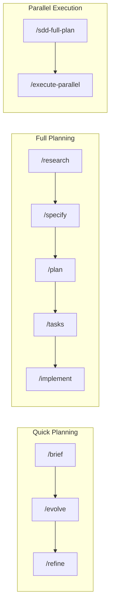
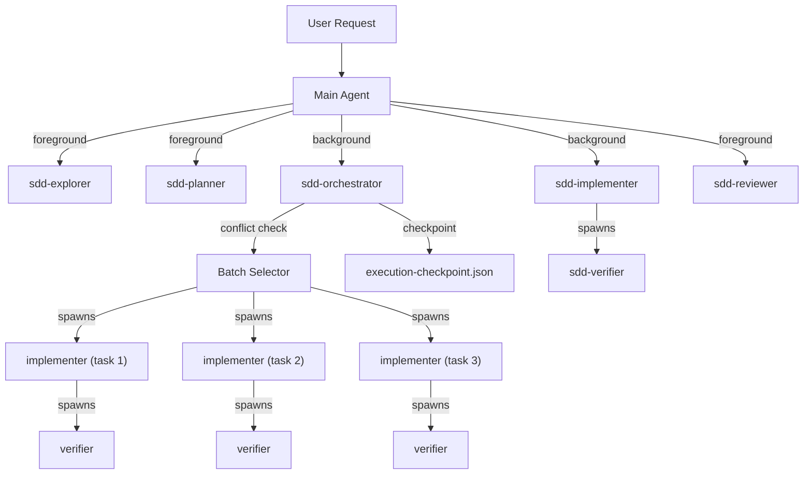

# SDD Cursor Commands v5.0

<div align="center">

[](https://github.com/madebyaris/spec-kit-command-cursor/stargazers)
[](https://opensource.org/licenses/MIT)
[](http://makeapullrequest.com)
[](https://cursor.com)

**Spec-Driven Development for Cursor IDE**

Create specifications before code. Plan-approve-execute for all operations.

[Quick Start](#quick-start) • [Commands](#commands) • [Subagents & Skills](#subagents--skills) • [What's New](#whats-new-in-v50) • [Contributing](#contributing)

</div>

---

## What's New in v5.0

- **Async Subagents** — Background subagents (`is_background: true`) let the parent agent continue working while long tasks run
- **Subagent Tree** — Subagents spawn their own subagents: orchestrator → implementers → verifiers
- **Deep Research** — Multi-pass external investigation with web search, documentation deep-dives, real-world validation, and confidence scoring (`/research --deep`)
- **File Conflict Detection** — Tasks declare `touchedFiles` so the orchestrator can prevent parallel edits to the same files
- **Progressive Context Loading** — Heavy roadmaps (40+ tasks) load only the current batch, not the full task list
- **Checkpoints & Resume** — `execution-checkpoint.json` enables `/execute-parallel --resume` after interruption
- **Downstream Propagation** — `/evolve` marks stale downstream docs when a spec changes
- **Deadlock Detection** — Orchestrator detects circular dependency deadlocks and per-task timeouts
- **Hooks** — Workflow automation via `.cursor/hooks.json` (`subagentStop`, `stop` events)
- **Sandbox Controls** — Granular network access via `.cursor/sandbox.json`
- **Plugin Packaging** — Distributable as a Cursor Marketplace plugin (`.cursor-plugin/`)

---

## Quick Start

```bash
git clone https://github.com/madebyaris/spec-kit-command-cursor.git
cd spec-kit-command-cursor
```

**Most common flow** (copy into Cursor chat):
```
/brief user-auth JWT authentication with login/logout
```

**Full planning:**
```bash
/sdd-full-plan blog-platform Full-featured blog with CMS
/execute-parallel blog-platform --until-finish
```

**Deep research before planning:**
```bash
/research database-engine Best database for our use case --deep
```

---

## Commands

### Planning

| Command | Purpose | Output |
|---------|---------|--------|
| `/brief` | 30-min quick planning | `feature-brief.md` |
| `/research` | Pattern investigation (supports `--deep`) | `research.md` |
| `/specify` | Detailed requirements | `spec.md` |
| `/plan` | Technical architecture | `plan.md` |
| `/tasks` | Task breakdown | `tasks.md` |
| `/generate-prd` | PRD via Socratic questions | `full-prd.md` |
| `/sdd-full-plan` | Complete project roadmap | `roadmap.json` + tasks |

### Execution

| Command | Purpose |
|---------|---------|
| `/implement` | Execute implementation with todo tracking |
| `/execute-task` | Run single task from roadmap (`--until-finish` supported) |
| `/execute-parallel` | Parallel DAG execution via async subagents (`--resume`, `--dry-run`) |

### Maintenance

| Command | Purpose |
|---------|---------|
| `/evolve` | Update specs with discoveries + downstream propagation |
| `/refine` | Iterate on specs through discussion |
| `/upgrade` | Brief → Full SDD planning |
| `/audit` | Compare implementation against specs |
| `/generate-rules` | Auto-generate coding rules |

---

## Subagents & Skills

### Subagents (`.cursor/agents/`)

Specialized agents with isolated context. Background agents run asynchronously — the parent continues working.

| Subagent | Model | Mode | Purpose |
|----------|-------|------|---------|
| `sdd-explorer` | fast | foreground, readonly | Codebase discovery |
| `sdd-planner` | inherit | foreground | Architecture design |
| `sdd-implementer` | inherit | **background** | Code generation |
| `sdd-verifier` | fast | foreground | Post-implementation completeness check |
| `sdd-reviewer` | fast | foreground, readonly | Pre-merge quality review |
| `sdd-orchestrator` | inherit | **background** | Parallel task coordination with DAG |

**Reviewer vs Verifier:** The reviewer is a pre-merge quality gate (security, performance, style). The verifier is a post-implementation completeness check (does the code match the spec?). Verifier answers "is it done?", Reviewer answers "is it good?"

#### Subagent Tree (Cursor 2.5+)

Subagents can spawn their own subagents, enabling true parallel DAG execution:

```
sdd-orchestrator (background)
├── sdd-implementer (task 1) → sdd-verifier
├── sdd-implementer (task 2) → sdd-verifier
└── sdd-implementer (task 3) → sdd-verifier
```

### Skills (`.cursor/skills/`)

Auto-invoked domain knowledge packages with progressive loading:

| Skill | Auto-Invoke When | Key References |
|-------|------------------|----------------|
| `sdd-research` | Technical approach unclear | `patterns.md`, `deep-research-guide.md` |
| `sdd-planning` | Spec exists, need plan | `estimation-heuristics.md`, `diagram-templates.md` |
| `sdd-implementation` | Plan ready for execution | `patterns.md`, `progress.sh` |
| `sdd-audit` | Code review requested | `checklist.md`, `validate.sh` |
| `sdd-evolve` | Discoveries during development | `changelog-format.md`, `propagation-guide.md`, `check-staleness.sh` |

Each skill folder contains:
```
sdd-[name]/
├── SKILL.md          # Core instructions
├── references/       # Loaded on demand
├── scripts/          # Executable helpers
└── assets/           # Templates
```

---

## Workflows


```mermaid
flowchart LR
    subgraph quick [Quick Planning]
        A["/brief"] --> B["/evolve"]
        B --> C["/refine"]
    end
    subgraph full [Full Planning]
        D["/research"] --> E["/specify"] --> F["/plan"] --> G["/tasks"] --> H["/implement"]
    end
    subgraph parallel [Parallel Execution]
        I["/sdd-full-plan"] --> J["/execute-parallel"]
    end
```

| Flow | Commands |
|------|----------|
| **Quick** (80% of features) | `/brief` → `/evolve` → `/refine` |
| **Full** (complex features) | `/research` → `/specify` → `/plan` → `/tasks` → `/implement` |
| **Deep Research** (unfamiliar domain) | `/research --deep` → `/specify` → `/plan` → `/tasks` → `/implement` |
| **Parallel** (project roadmap) | `/sdd-full-plan` → `/execute-parallel` |
| **Heavy App** (20+ tasks) | `/sdd-full-plan` (Option C: Phased for 40+) → `/execute-parallel --until-finish` |

### Heavy App Path

For new apps with 20+ tasks or enterprise complexity:
1. `/sdd-full-plan [project-id] [description]` — create roadmap with DAG
2. For 40+ tasks: choose **Option C: Phased Creation** to create epics incrementally
3. `/execute-parallel [project-id] --until-finish` — run all tasks with conflict detection
4. `/execute-parallel [project-id] --resume` — resume after interruption via checkpoint

### Deep Research

For high-stakes technical decisions (database engines, auth providers, cloud platforms):
```bash
/research auth-provider Compare Auth0 vs Clerk vs Supabase Auth --deep
```

Deep research performs 4 passes: landscape scan → documentation deep-dive → real-world validation → integration feasibility. Results include source URLs, reliability ratings, and a confidence assessment.

### Automated Execution
```bash
# Execute until complete
/execute-task epic-001 --until-finish

# Create and execute entire project
/sdd-full-plan my-project --until-finish
```

---

## Architecture


```mermaid
graph TD
    User["User Request"] --> MainAgent["Main Agent"]
    MainAgent -->|foreground| Explorer["sdd-explorer"]
    MainAgent -->|foreground| Planner["sdd-planner"]
    MainAgent -->|background| Orchestrator["sdd-orchestrator"]
    MainAgent -->|background| Implementer["sdd-implementer"]
    MainAgent -->|foreground| Reviewer["sdd-reviewer"]

    Orchestrator -->|"conflict check"| BatchSelector["Batch Selector"]
    BatchSelector -->|spawns| Impl1["implementer (task 1)"]
    BatchSelector -->|spawns| Impl2["implementer (task 2)"]
    BatchSelector -->|spawns| Impl3["implementer (task 3)"]

    Orchestrator -->|checkpoint| Checkpoint["execution-checkpoint.json"]

    Implementer -->|spawns| Verifier["sdd-verifier"]
    Impl1 -->|spawns| V1["verifier"]
    Impl2 -->|spawns| V2["verifier"]
    Impl3 -->|spawns| V3["verifier"]
```

---

## Project Structure

```
.cursor/
├── agents/           # 6 subagents (foreground + background)
├── skills/           # 5 skills with progressive loading
├── commands/         # Slash commands
├── rules/            # Always-applied rules
├── hooks.json        # Workflow automation hooks
└── sandbox.json      # Network access controls

.cursor-plugin/
└── plugin.json       # Cursor Marketplace manifest

.sdd/
├── config.json       # Project configuration
├── guidelines.md     # Methodology guide
├── ROADMAP_FORMAT_SPEC.md  # Roadmap JSON schema (with DAG)
├── FULL_PLAN_EXAMPLES.md   # Worked examples at 3 complexity levels
├── templates/        # Document templates (compact + specialized)
└── archive/          # Historical implementation docs

specs/
├── active/           # Features in development
├── backlog/          # Future features
├── todo-roadmap/     # Project roadmaps with DAG
└── completed/        # Delivered features
```

---

## Hooks & Sandbox

### Hooks (`.cursor/hooks.json`)

Workflow automation triggered by agent events:

| Hook | Trigger | Purpose |
|------|---------|---------|
| `subagentStop` | SDD subagent completes | Log task ID, timestamp, and outcome |
| `stop` | Agent session ends | Generate session timestamp |

### Sandbox (`.cursor/sandbox.json`)

Granular network access controls for sandboxed commands. Defaults allow common package registries (npm, pypi, GitHub, Docker, Deno) while denying private networks. Customize by editing `.cursor/sandbox.json`.

---

## Templates

Available in `.sdd/templates/`:

| Template | Purpose |
|----------|---------|
| `feature-brief-v2.md` | Quick 30-min planning brief |
| `spec-compact.md` | Requirements specification |
| `plan-compact.md` | Technical plan (with heavy-app extensions) |
| `tasks-compact.md` | Task breakdown |
| `research-compact.md` | Research findings |
| `todo-compact.md` | Implementation checklist |
| `audit-report.md` | Structured audit output |
| `changelog.md` | Spec evolution log |
| `progress-report.md` | Execution progress summary |
| `retrospective.md` | Post-mortem / lessons learned |
| `roadmap-template.json` | Kanban JSON structure |
| `roadmap-template.md` | Human-readable roadmap |
| `decision-matrix.md` | Brief vs Full SDD decision guide |

---

## Plugin Distribution

SDD is packaged as a Cursor Marketplace plugin. Install via `/add-plugin` or clone the repo directly. See `.cursor-plugin/plugin.json` for the manifest.

---

## Contributing

- [Contributing guide](CONTRIBUTING.md) - How to add commands, subagents, skills, and templates
- [Report bugs](https://github.com/madebyaris/spec-kit-command-cursor/issues)
- [Suggest features](https://github.com/madebyaris/spec-kit-command-cursor/discussions)

## Acknowledgments

Thanks to [ClavixDev](https://github.com/ClavixDev) for valuable ideas and suggestions!

## License

MIT License - see [LICENSE](LICENSE)

---

<div align="center">

**Made with ❤️ by [Aris](https://github.com/madebyaris)**

Try it: `/brief hello-world Create a simple hello world feature`

</div>
